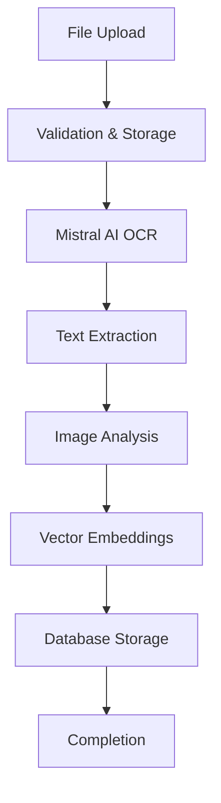

# DocuAI - Automated OCR & Document Processing Platform

A modern web application that provides AI-powered OCR and document processing capabilities with real-time processing updates and enterprise-grade document management.


## 🚀 Features

### Core Capabilities
- **AI-Powered OCR**: Advanced text extraction using Mistral AI Document AI
- **Multi-Format Support**: PDF, DOCX, PNG, JPEG, TIFF files up to 50MB
- **Unicode Support**: Perfect handling of special characters (äöß, é, ñ, etc.)
- **Intelligent Image Analysis**: Automatic extraction and annotation of charts, diagrams, and visual elements
- **Vector Embeddings**: Semantic search capabilities using Mistral AI embeddings
- **Real-Time Processing**: Live status updates with animated loading states

### User Experience
- **Modern Interface**: Clean, responsive design with dark/light theme support
- **Drag & Drop Upload**: Intuitive file upload with progress tracking
- **Animated Loading**: Beautiful document type icons during processing
- **Dashboard Analytics**: Processing statistics and document management
- **Real-Time Updates**: Live processing status with automatic refresh

## 🏗️ Architecture

### Technology Stack
- **Frontend**: React 18 + TypeScript + Vite
- **Backend**: Express.js + TypeScript
- **Database**: PostgreSQL with Drizzle ORM
- **AI Processing**: Mistral AI Document AI
- **Styling**: Tailwind CSS + shadcn/ui components
- **State Management**: TanStack Query

### Database Design
```
📦 Unified PostgreSQL Database
├── users (authentication & profiles)
├── documents (metadata & file storage)
├── extracted_images (image annotations)
├── vector_embeddings (semantic search)
├── processing_queue (real-time status)
└── sessions (authentication sessions)
```

### Storage Architecture
- **Unified Storage**: Everything stored in single Replit PostgreSQL database
- **File Storage**: Documents and images stored as base64 in BYTEA fields
- **Vector Storage**: Embeddings stored as PostgreSQL real arrays
- **Session Management**: PostgreSQL-based session storage

## 🛠️ Setup & Installation

### Prerequisites
- Node.js 18+ with npm
- PostgreSQL database
- Mistral AI API key

### Environment Variables
```bash
# Required
DATABASE_URL=postgresql://...
MISTRAL_API_KEY=your_mistral_api_key

# Auto-configured by Replit
PGHOST=localhost
PGPORT=5432
PGUSER=username
PGPASSWORD=password
PGDATABASE=dbname
```

### Installation Steps

1. **Clone the repository**
   ```bash
   git clone <your-repo-url>
   cd docuai
   ```

2. **Install dependencies**
   ```bash
   npm install
   ```

3. **Set up the database**
   ```bash
   npm run db:push
   ```

4. **Start the development server**
   ```bash
   npm run dev
   ```

5. **Access the application**
   - Frontend: `http://localhost:5000`
   - Backend API: `http://localhost:5000/api`

## 📊 API Endpoints

### Authentication
- `GET /api/auth/user` - Get current user
- `GET /api/login` - Login redirect
- `GET /api/logout` - Logout

### Document Management
- `POST /api/documents/upload` - Upload document for processing
- `GET /api/documents` - List user documents
- `GET /api/documents/:id` - Get document details
- `GET /api/documents/:id/images` - Get extracted images

### Processing & Analytics
- `GET /api/processing/active` - Get active processing jobs
- `GET /api/analytics/stats` - Get user statistics
- `POST /api/documents/search` - Vector similarity search

## 🔄 Document Processing Pipeline



### Processing Steps
1. **Upload & Validation**: File type and size validation
2. **OCR Processing**: Mistral AI Document AI extracts text and images
3. **Image Analysis**: Intelligent annotation of visual elements
4. **Vector Generation**: Create embeddings for semantic search
5. **Storage**: Save all data to PostgreSQL database
6. **Real-Time Updates**: Live status tracking throughout pipeline

## 🌐 Special Character Support

DocuAI fully supports Unicode characters in filenames and content:

- **German**: ä, ö, ü, ß
- **French**: é, è, à, ç
- **Spanish**: ñ, í, ó
- **Symbols**: €, £, ¥, and more

Example filename: `document-äöß.pdf` ✅

## 📁 Project Structure

```
docuai/
├── client/                 # React frontend
│   ├── src/
│   │   ├── components/     # Reusable UI components
│   │   ├── pages/         # Application pages
│   │   └── lib/           # Utilities and hooks
├── server/                # Express backend
│   ├── services/          # External service integrations
│   ├── storage-replit.ts  # Database operations
│   ├── routes-database.ts # API route handlers
│   └── db.ts             # Database connection
├── shared/               # Shared types and schemas
│   └── schema.ts        # Drizzle database schema
└── attached_assets/     # Static assets
```

## 🚦 Development Scripts

```bash
# Development
npm run dev              # Start development server

# Database
npm run db:push          # Push schema changes to database
npm run db:studio        # Open Drizzle Studio (database GUI)

# Build
npm run build            # Build for production
npm start               # Start production server
```

## 📈 Performance Features

- **Concurrent Processing**: Parallel file upload and AI processing
- **Caching**: TanStack Query for optimized data fetching
- **Real-Time Updates**: Efficient WebSocket-like polling for status
- **Optimized Database**: Indexed queries with connection pooling
- **Responsive UI**: Mobile-first design with lazy loading

## 🔒 Security

- **File Validation**: Strict MIME type and size checking
- **SQL Injection Prevention**: Parameterized queries with Drizzle ORM
- **Input Sanitization**: Comprehensive validation with Zod schemas
- **Session Management**: Secure PostgreSQL-based sessions
- **CORS Protection**: Configured for production deployment

## 🌟 Key Achievements

- ✅ **Unified Database Architecture**: Single PostgreSQL database for all storage needs
- ✅ **Perfect Unicode Support**: Handles special characters in filenames and content
- ✅ **Real AI Integration**: Mistral AI for professional OCR and analysis
- ✅ **Animated User Experience**: Beautiful loading states with document type icons
- ✅ **Scalable Design**: Built for enterprise-grade document processing

## 🤝 Contributing

1. Fork the repository
2. Create a feature branch (`git checkout -b feature/amazing-feature`)
3. Commit your changes (`git commit -m 'Add amazing feature'`)
4. Push to the branch (`git push origin feature/amazing-feature`)
5. Open a Pull Request

## 📄 License

This project is licensed under the MIT License - see the [LICENSE](LICENSE) file for details.

## 🙏 Acknowledgments

- **Mistral AI** for powerful document processing capabilities
- **Replit** for seamless development and database hosting
- **shadcn/ui** for beautiful, accessible UI components
- **Drizzle ORM** for type-safe database operations

---

**Built with ❤️ using modern web technologies**

For questions or support, please open an issue in the repository.